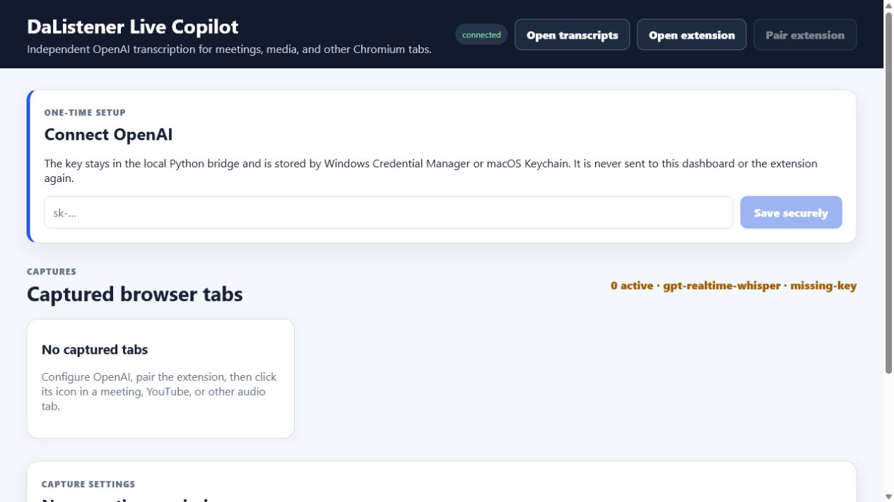
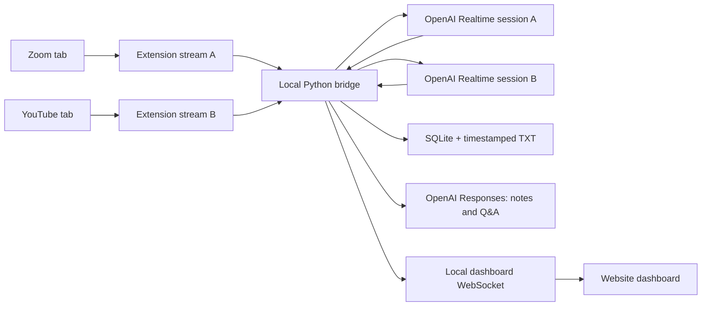

# DaListener

### An OpenAI meeting and media copilot for independent Chromium tabs

[](https://www.microsoft.com/windows)
[](https://www.apple.com/macos/)
[](https://developers.openai.com/)
[](https://www.python.org/)
[](https://github.com/TheRealStubbornDeveloper/DaListener)

DaListener captures audio from user-selected Chrome, Edge, or Chromium tabs. Every tab becomes an independent OpenAI transcription stream with its own transcript, alerts, notes, and Q&A context. Meeting sites start directly; YouTube and other media receive a clear confirmation before audio leaves the computer.



> [!IMPORTANT]
> This branch uses OpenAI for transcription and intelligence. Audio and transcript context are sent to the OpenAI API. The old local Moonshine/Whisper desktop implementation remains only as an optional legacy path.

## Alpha 2 status

| Area | Status |
|---|---|
| Windows 10/11 | MSI and portable ZIP built and validated locally |
| Chromium capture | Chrome and Edge tab capture, including simultaneous independent tabs |
| Meeting sources | Zoom, Google Meet, Microsoft Teams, and Webex start directly |
| Media sources | YouTube, Vimeo, Twitch, and unfamiliar sites require confirmation |
| macOS 13+ | Application and universal DMG build scripts are ready; VM build/testing remains on the roadmap |

Current Windows MSI SHA-256:

```text
f1bf78036d3c2a253cb1abd9b0a1d8a9115838b3f874c158403ccebc309b710d
```

## What it does

- Captures multiple meeting or media tabs independently; overlapping streams never get mixed together.
- Recognizes common meeting sites such as Zoom, Google Meet, Teams, and Webex.
- Warns before capturing YouTube, Vimeo, Twitch, or an unfamiliar website. The user can remember approval per website and reset approvals from the dashboard.
- Uses `gpt-realtime-whisper` for low-latency streaming transcription.
- Saves final revisions in SQLite for recovery and writes a timestamped TXT file when capture stops.
- Detects `Vladimir` and `Vlad` with exact local matching and highlights the relevant utterance.
- Uses OpenAI every 30 seconds for summaries, decisions, action items, unfamiliar-technology explanations, and conservative reply suggestions.
- Answers questions such as “What did Arjun just say?” using the selected stream's transcript.
- Never requests microphone access. Join as a listener on this machine and speak from another device.
- Keeps the OpenAI API key in the Python bridge and operating-system keychain—not in the extension or dashboard JavaScript.

## Architecture



There is no local CPU/GPU transcription fallback and no artificial meeting limit. Practical concurrency depends on network quality and the OpenAI usage tier and rate limits attached to the configured API key. A failed or rate-limited stream is surfaced on its own card without being merged into another stream.

## Install on Windows

The easiest option is the locally built MSI. Opening it requests administrator approval once because it installs for all users under `Program Files`. DaListener itself runs with normal user privileges.

### Quick start with the MSI

1. Build the installer with `build-msi.ps1`, or obtain the alpha 2 MSI from the project owner.
2. Open `dist\DaListener-0.3.0-alpha.2-windows-x64.msi` and approve the installer prompt.
3. Start **DaListener** from the Windows Start menu.
4. Save an OpenAI API key in the one-time setup panel.
5. Select **Open extension**, load that folder as an unpacked Chromium extension, then select **Pair extension** and paste the pairing JSON into the extension options.
6. Click the extension icon in every tab you want to transcribe. Each tab receives a separate transcript and OpenAI session.

The alpha installer is unsigned, so Windows can show an **Unknown publisher** warning. Verify its SHA-256 against the value above before installation.

```powershell
(Get-FileHash .\dist\DaListener-0.3.0-alpha.2-windows-x64.msi -Algorithm SHA256).Hash.ToLowerInvariant()
```

### Run from source

For a source checkout, install Python 3.11+, Node.js 20+, Chrome/Edge 116+, and configure an OpenAI API key with billing and Realtime API access:

```powershell
git clone https://github.com/TheRealStubbornDeveloper/DaListener.git
cd DaListener
git switch codex/feature-rich-mvp
.\setup.bat
.\run.bat
```

The dashboard opens in the default browser. Paste the OpenAI API key into the one-time setup card; DaListener stores it in Windows Credential Manager.

### Load and pair the extension

1. Open `chrome://extensions` or `edge://extensions`.
2. Enable **Developer mode**, select **Load unpacked**, then choose the `BrowserExtension` folder shown by the dashboard's **Open extension** button. A source checkout can use the repository's `extension` folder instead.
3. In DaListener, select **Pair extension**.
4. Open the extension options, paste the copied JSON, and save it.
5. Open a Zoom, Meet, Teams, Webex, YouTube, or other audio tab and click the DaListener icon.
6. Meeting sites begin immediately. Media and unfamiliar sites first explain what is being captured and require confirmation. A red `REC` badge means that tab has its own stream; click again to stop it.

Chrome requires a user gesture for each tab capture. Capturing normally mutes a tab, so DaListener explicitly routes the captured stream back to the browser's audio output.

## Development

Backend and production dashboard:

```powershell
.venv\Scripts\Activate.ps1
npm.cmd --prefix frontend run build
python -m dalistener.dashboard.server
```

Frontend hot reload (run the backend separately):

```powershell
npm.cmd --prefix frontend run dev
```

Tests:

```powershell
python -m pytest
npm.cmd --prefix frontend run build
```

Set `OPENAI_API_KEY` to use an environment variable instead of the OS keychain. The service reads `DALISTENER_TRANSCRIPTION_MODEL` and `DALISTENER_INTELLIGENCE_MODEL` for model overrides.

## Build Windows packages locally

No GitHub-hosted runner is required. The portable archive build is:

```powershell
powershell.exe -NoProfile -ExecutionPolicy Bypass -File .\build-release.ps1
```

The MSI build also creates the portable archive, downloads the official .NET 8 SDK into `build\tools`, installs WiX 5 locally, and writes an SHA-256 checksum:

```powershell
powershell.exe -NoProfile -ExecutionPolicy Bypass -File .\build-msi.ps1
```

Outputs:

```text
dist\
|-- DaListener\
|   |-- DaListener.exe
|   `-- _internal\
|-- DaListener-0.3.0-alpha.2-windows-x64.zip
|-- DaListener-0.3.0-alpha.2-windows-x64.msi
`-- DaListener-0.3.0-alpha.2-windows-x64.msi.sha256
```

Beta packages are unsigned by default. To sign locally, install `signtool.exe` and set `DALISTENER_WINDOWS_SIGN_PFX` and `DALISTENER_WINDOWS_SIGN_PASSWORD` before running the MSI build.

The build is intentionally local: it does not create or require a GitHub Actions workflow. Upload the MSI, ZIP, and checksum to a GitHub Release manually when a public prerelease is desired.

## Build macOS in the future VM

The application code, Finder integration, OS keychain storage, universal PyInstaller specification, DMG creation, architecture checks, signing, and optional notarization hooks are included. The DMG must be built and tested on macOS; PyInstaller cannot cross-compile it from Windows.

On a locally controlled macOS 13+ VM with Python 3.11+, Node.js 20+, and Xcode command-line tools:

```bash
chmod +x ./build-release-macos.sh
./build-release-macos.sh
```

The script builds `dist/DaListener.app` and `dist/DaListener-0.3.0-alpha.2-macos-universal.dmg`, verifies both Apple Silicon and Intel slices, and writes a checksum. It uses ad-hoc signing unless `APPLE_CODESIGN_IDENTITY` is set. Set the `APPLE_NOTARY_*` variables to notarize with an App Store Connect key.

## File locations

| Item | Windows | macOS / source |
|---|---|---|
| Chromium extension | `%LOCALAPPDATA%\DaListener\BrowserExtension` | `~/Library/Application Support/DaListener/BrowserExtension` or `extension` |
| Portable executable | `dist\DaListener\DaListener.exe` | — |
| MSI / DMG | `dist\DaListener-0.3.0-alpha.2-windows-x64.msi` | `dist/DaListener-0.3.0-alpha.2-macos-universal.dmg` |
| Timestamped transcripts | `%LOCALAPPDATA%\DaListener\Transcripts` | `~/Library/Application Support/DaListener/Transcripts` |
| Recovery database | `%LOCALAPPDATA%\DaListener\sessions.db` | `~/Library/Application Support/DaListener/sessions.db` |
| Capture approvals | `%LOCALAPPDATA%\DaListener\preferences.json` | `~/Library/Application Support/DaListener/preferences.json` |
| OpenAI API key | Windows Credential Manager | macOS Keychain or `OPENAI_API_KEY` |

## Privacy and consent

Raw audio is kept only in bounded memory while relayed to OpenAI and is not written to disk. Final transcript text and generated notes are sensitive data. Notify participants, follow applicable recording and consent laws, protect the local account, and configure appropriate OpenAI data controls.

The bridge listens only on `127.0.0.1`, dashboard endpoints require an HttpOnly session cookie, and extension streams require a randomly generated pairing token. Pairing data does not contain the OpenAI API key.

## Roadmap

- Build and test the universal macOS application and DMG inside the locally controlled macOS VM.
- Keep release builds on developer machines and that VM. Completed MSI, DMG, and checksum files can be uploaded to GitHub Releases manually; DaListener will not depend on paid GitHub-hosted runners.
- Add production Windows signing and Apple Developer ID notarization credentials when distribution is ready.

## Current boundaries

- Chromium tab audio only; no microphone, native Zoom desktop-process capture, or per-speaker diarization.
- A user must click the extension icon in each tab to begin capture.
- Speaker names are preserved only when spoken or supplied in transcript text; tab audio does not expose Zoom participant metadata.
- Email notifications need a separately configured mail provider and are not enabled in this alpha.
- The extension is unpacked and not yet published to a browser store.
- The Windows MSI is locally validated but unsigned; the macOS package remains unverified until it is built in the VM.

## License

No open-source license has been selected. The source is all-rights-reserved.
