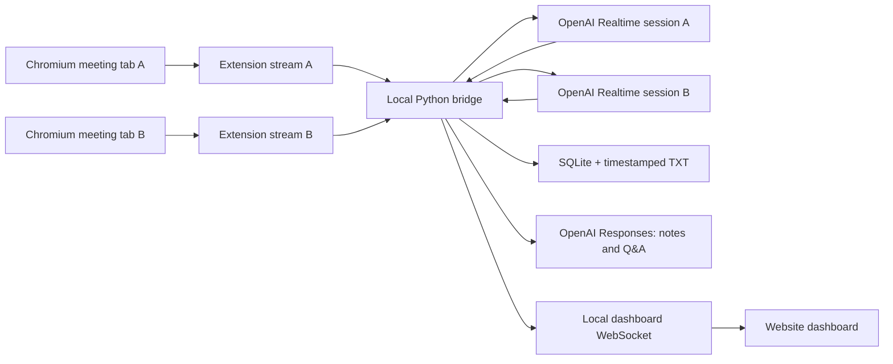

# DaListener

### An OpenAI meeting copilot for multiple Chromium tabs

[](https://www.microsoft.com/windows)
[](https://developers.openai.com/)
[](https://www.python.org/)
[](https://github.com/TheRealStubbornDeveloper/DaListener)

DaListener captures audio from user-selected Chrome, Edge, or Chromium tabs. Every tab becomes an independent meeting with its own OpenAI Realtime transcription session, transcript, alerts, notes, and Q&A context.


> [!IMPORTANT]
> This branch uses OpenAI for transcription and meeting intelligence. Audio and transcript context are sent to the OpenAI API. The old local Moonshine/Whisper desktop implementation is retained only as an optional legacy path.

## What it does

- Captures multiple meeting tabs independently; overlapping meetings do not get mixed together.
- Uses `gpt-realtime-whisper` for low-latency streaming transcription.
- Saves final revisions in SQLite for recovery and writes a timestamped TXT file when capture stops.
- Detects `Vladimir` and `Vlad` with exact local matching and highlights the relevant utterance.
- Uses OpenAI every 30 seconds for summaries, decisions, action items, unfamiliar-technology explanations, and conservative reply suggestions.
- Answers questions such as “What did Arjun just say?” using the selected meeting transcript.
- Never requests microphone access. Join as a listener on this machine and speak from another device.
- Keeps the OpenAI API key in the Python bridge and Windows Credential Manager—not in the extension or dashboard JavaScript.

## Architecture



There is no local CPU/GPU transcription fallback and no artificial meeting limit. Practical concurrency depends on network quality and the OpenAI usage tier and rate limits attached to the configured API key. A failed or rate-limited stream is surfaced on its own meeting card without merging it into another meeting.

## Install on Windows

Requirements:

- Windows 10 or 11
- Python 3.11+
- Node.js 20+ for a source build
- Chrome, Edge, or another Chromium browser version 116+
- An OpenAI API key with billing and Realtime API access

```powershell
git clone https://github.com/TheRealStubbornDeveloper/DaListener.git
cd DaListener
git switch codex/feature-rich-mvp
.\setup.bat
.\run.bat
```

The dashboard opens in the default browser. Paste the OpenAI API key into the one-time setup card; DaListener stores it through Windows Credential Manager.

### Load and pair the extension

1. Open `chrome://extensions` or `edge://extensions`.
2. Enable **Developer mode**, select **Load unpacked**, and choose the repository's `extension` folder.
3. In DaListener, select **Pair browser extension**.
4. Open the extension's options, paste the copied JSON, and save it.
5. Open a meeting tab and click the extension icon. A red `REC` badge means that tab has its own stream. Repeat for any other tab; click again to stop one stream.

Chrome requires that per-tab capture starts from a user gesture. Capturing a tab normally mutes it, so DaListener explicitly routes the captured stream back to the browser's audio output.

## Development

Backend and production dashboard:

```powershell
.venv\Scripts\Activate.ps1
npm.cmd --prefix frontend run build
python -m dalistener.dashboard.server
```

Frontend hot reload (run the backend separately):

```powershell
npm.cmd --prefix frontend run dev
```

Tests:

```powershell
python -m pytest
npm.cmd --prefix frontend run build
```

Set `OPENAI_API_KEY` to use an environment variable instead of Credential Manager. The service reads `DALISTENER_TRANSCRIPTION_MODEL` and `DALISTENER_INTELLIGENCE_MODEL` for model overrides.

## Build the Windows test archive

Download the unsigned portable [DaListener 0.3.0 alpha 1 test build](https://github.com/TheRealStubbornDeveloper/DaListener/releases/tag/v0.3.0-alpha.1), extract the complete folder, and run `DaListener.exe`. Keep `_internal` beside the executable. The unpacked Chromium extension is loaded separately from this repository's `extension` folder.

```powershell
powershell.exe -NoProfile -ExecutionPolicy Bypass -File .\build-release.ps1
```

Outputs:

```text
dist\
|-- DaListener\
|   |-- DaListener.exe
|   `-- _internal\
`-- DaListener-0.3.0-alpha.1-windows-x64.zip
```

Load the extension separately from the source `extension` directory for this alpha. The portable executable serves the built React dashboard and opens it with a one-time local authentication token.

## File locations

| Item | Location |
|---|---|
| Source dashboard | `frontend` |
| Built dashboard | `frontend\dist` |
| Chromium extension | `extension` |
| Portable executable | `dist\DaListener\DaListener.exe` |
| Release ZIP | `dist\DaListener-0.3.0-alpha.1-windows-x64.zip` |
| Timestamped transcripts | `%LOCALAPPDATA%\DaListener\Transcripts` |
| Recovery database | `%LOCALAPPDATA%\DaListener\sessions.db` |
| OpenAI API key | Windows Credential Manager (`DaListener/OpenAI`) or `OPENAI_API_KEY` |

## Privacy and consent

Raw audio is kept only in bounded memory while it is relayed to OpenAI and is not written to disk. Final transcript text and generated meeting notes are sensitive data. Notify participants, follow the recording and consent laws that apply to the meeting, protect the Windows account, and configure OpenAI data controls appropriate for the organization.

The bridge listens only on `127.0.0.1`, dashboard endpoints require an HttpOnly session cookie, and extension streams require a randomly generated pairing token. Pairing data does not contain the OpenAI API key.

## Current boundaries

- Chrome/Chromium tab audio only; no microphone, native Zoom desktop-process capture, or per-speaker diarization.
- A user must click the extension icon in each tab to begin capture.
- Speaker names are preserved only when spoken or supplied in transcript text; tab audio alone does not expose Zoom participant metadata.
- Email notifications need a separately configured mail provider and are not enabled in this alpha.
- The extension is unpacked in this alpha and is not yet published to a browser store.

## License

No open-source license has been selected. The source is all-rights-reserved.
