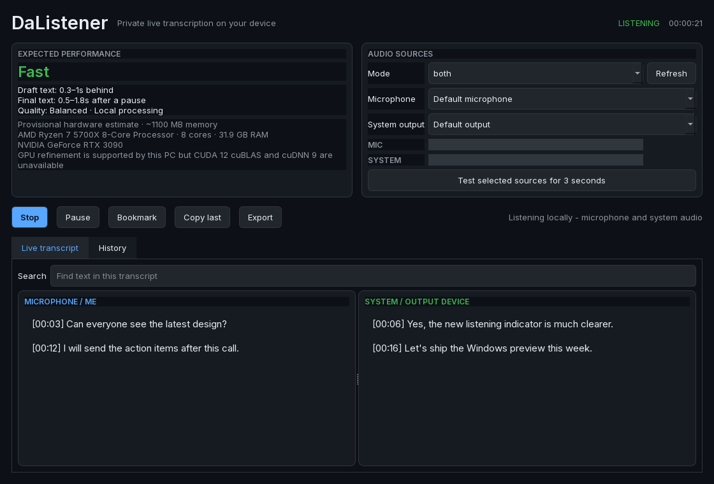
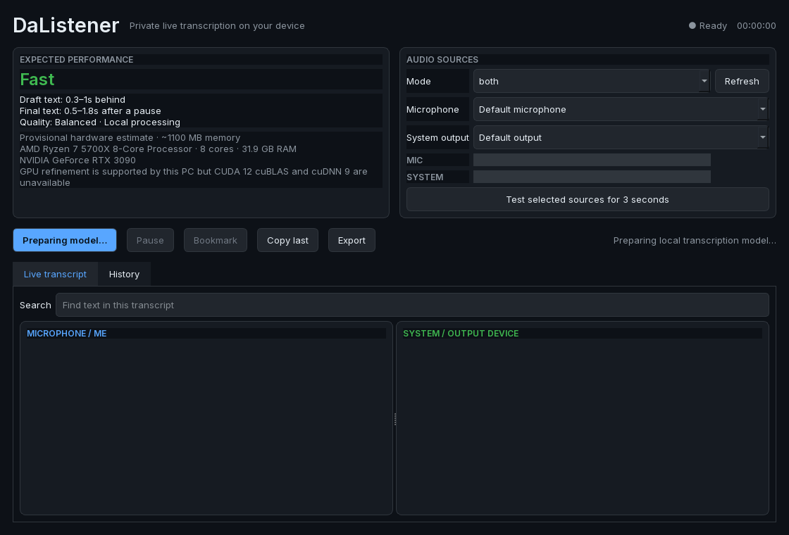
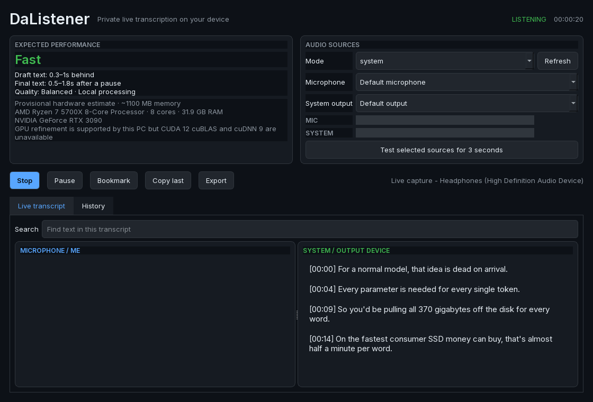

# DaListener

### Private, live-ish transcription for everything you hear

[](https://www.microsoft.com/windows)
[](https://www.python.org/)
[](#privacy)
[](https://github.com/TheRealStubbornDeveloper/DaListener)

DaListener captures a microphone, Windows system audio, or both at once and turns them into separate, searchable transcript lanes. Speech recognition runs locally; raw audio is discarded by default.



> [!NOTE]
> DaListener is an early Windows-first prototype. It is useful today, but it is not yet a signed, production-ready recorder.

## Why DaListener?

- **Hear both sides.** Transcribe your microphone and everything rendered through a selected output device.
- **Keep speakers separate.** “Me” and “System” remain independent instead of becoming one confused audio mix.
- **See words settle.** Draft text updates quickly; finalized utterances become immutable.
- **Know before you start.** Hardware inspection and real-speech calibration disclose expected latency, quality mode, and memory use.
- **Stay private.** After model download, transcription is local and audio is not written to disk.
- **Own the result.** Search, bookmark, copy, retain session history, and export TXT, Markdown, JSON, SRT, or VTT.



## How it works

```text
Microphone ── WASAPI capture ──┐
                               ├─ resample ─ VAD ─ Moonshine ─ transcript lanes ─ SQLite
System audio ─ WASAPI loopback ┘
                                      └─ optional Whisper GPU finalizer
```

DaListener uses [Moonshine Medium Streaming](https://github.com/moonshine-ai/moonshine) for CPU-friendly live transcription. On a supported NVIDIA setup, `faster-whisper` with `large-v3-turbo` can refine completed phrases in Best mode.

### Real system-audio capture

The screenshot below was produced from an actual 20-second WASAPI loopback test—not a designed transcript mockup. DaListener captured audio playing through the default headphones and finalized four utterances locally.



The test also exposed Media Foundation buffer-discontinuity warnings on this particular endpoint. Recognition completed successfully, but extended device-matrix and soak testing remains part of the Windows stabilization work.

## Measured performance

On a Ryzen 7 5700X and RTX 3090, the same Whisper `large-v3-turbo` model processed a 20-second clip in **6.176 seconds on CPU** and **0.288 seconds on GPU**. That makes GPU inference **21.44× faster** in this test; both paths produced the same transcript.

| Device | Median inference | Processing rate |
|---|---:|---:|
| Ryzen 7 5700X, INT8 | 6.176 s | 3.24× real time |
| RTX 3090, INT8/FP16 | 0.288 s | 69.43× real time |

See the [benchmark methodology and raw results](docs/BENCHMARKS.md). These numbers measure throughput for one machine and utterance, not guaranteed latency or accuracy.

## Install on Windows

Requirements:

- 64-bit Windows 10 or 11
- Python 3.11 or newer
- About 1 GB free for the application and Balanced model
- 8 GB RAM and four physical CPU cores recommended

Clone the repository, then run:

```powershell
setup.bat
run.bat
```

The first launch downloads the recommended English model and runs a local dual-lane speech calibration. Later launches reuse both the model and capability report until relevant hardware, runtime, or model details change.

### Download the test build

Download [`DaListener-0.2.0-alpha.2-windows-x64.zip`](https://github.com/TheRealStubbornDeveloper/DaListener/releases/tag/v0.2.0-alpha.2), choose **Extract All**, and run `DaListener.exe`. Do not run it inside the ZIP. The first launch needs internet access to download the selected speech model; transcription is local afterward.

This is an unsigned test build, so Windows SmartScreen may show an unknown-publisher warning. Verify that the ZIP came from this repository and that its SHA-256 is:

```text
1c20109672d2737f5105329a6ab7e8dc378850c526b47ff38b42ab5dd0174829
```

The archive includes CPU transcription and the optional Whisper engine, but not the roughly 1.3 GB NVIDIA compatibility runtime. It uses Best mode when CUDA 12 cuBLAS and cuDNN 9 DLLs are available globally; otherwise it transparently uses Balanced CPU mode.

### Developer setup

```powershell
py -3.12 -m venv .venv
.venv\Scripts\Activate.ps1
python -m pip install -e ".[test]"
python -m dalistener.app
```

Run the test suite:

```powershell
python -m pytest
```

## Enable NVIDIA Best mode

Best mode requires the CUDA 12 build of cuBLAS, cuDNN 9, and the optional Whisper runtime. A modern NVIDIA driver is required, but the globally installed CUDA Toolkit may be a different version because the development setup isolates compatible libraries inside `.venv`.

1. Install or update the NVIDIA display driver.
2. Open a terminal in the source checkout and install DaListener's optional runtime. On Windows this installs NVIDIA's CUDA 12.9 cuBLAS and cuDNN 9 wheels inside the virtual environment:

```powershell
.venv\Scripts\Activate.ps1
python -m pip install -e ".[best]"
```

3. Verify detection and load the actual finalizer:

```powershell
nvidia-smi
python -c "from pathlib import Path; from dalistener.capability import CapabilityService; r=CapabilityService(Path('build/cuda-check.json')).inspect(); print(r.quality_mode.value, r.model_name, r.downgrade_reasons)"
```

Restart DaListener. Its capability card should show **Quality: Best** and list GPU refinement. If a required DLL cannot be loaded, the app safely remains in Balanced CPU mode and explains the downgrade.

For the packaged test build, install CUDA 12.x and cuDNN 9 globally and place their `bin` directories on `PATH`, or use the source installation above. A CUDA 13 toolkit provides `cublas64_13.dll`, which does not replace the `cublas64_12.dll` required by the current CTranslate2 build.

See NVIDIA's [CUDA installation guide for Windows](https://docs.nvidia.com/cuda/cuda-installation-guide-microsoft-windows/) and [cuDNN Windows installation guide](https://docs.nvidia.com/deeplearning/cudnn/installation/latest/windows.html) for authoritative compatibility and installation details.

## Build the Windows archive

```powershell
powershell.exe -NoProfile -ExecutionPolicy Bypass -File .\build-release.ps1
```

The onedir application and ZIP are written under `dist/`. Build output, downloaded models, databases, and virtual environments are ignored by Git.

## Native-core direction

“Make it native C” should mean moving latency-sensitive services into a portable **C++ core with a stable C ABI**, while keeping the desktop UI replaceable. Rewriting the entire application in C would add substantial complexity without improving the transcript UI or storage layer.

The intended split is:

| Layer | Responsibility | Technology |
|---|---|---|
| Desktop shell | Windows, controls, transcript presentation | Current PySide shell initially; native UI can follow |
| `dalistener_core` | Audio queues, resampling, VAD, ASR sessions, event aggregation | C++20 |
| Public boundary | Versioned opaque handles and callbacks | C ABI |
| Windows capture | Microphone and render-device loopback | WASAPI |
| Recognition | Streaming inference | Moonshine C++ + ONNX Runtime |
| Optional refinement | Completed-utterance recheck | Separate GPU worker/process |
| Persistence | Sessions, bookmarks, exports | SQLite |

Recommended migration sequence:

1. Define ABI-safe structs and functions in `include/dalistener.h`; never expose STL types or C++ exceptions.
2. Wrap Moonshine's existing portable C++/C interfaces instead of rewriting its inference engine.
3. Move WASAPI capture and bounded per-source queues into `dalistener_core.dll`.
4. Expose transcript events through a callback plus an explicit `dalistener_free_string` ownership rule.
5. Bind the DLL to the current UI with `ctypes` or `cffi` and compare transcripts against the Python implementation.
6. Add CMake presets and CI builds for Windows x64 and Linux x64 before replacing more UI code.

A minimal API shape would be:

```c
typedef struct dl_engine dl_engine;

typedef void (*dl_transcript_callback)(
    const char *source_id,
    const char *utterance_id,
    const char *utf8_text,
    int64_t start_ms,
    int64_t end_ms,
    int is_final,
    void *user_data);

int dl_engine_create(const dl_config *config, dl_engine **out_engine);
int dl_engine_start(dl_engine *engine, const dl_capture_selection *selection);
int dl_engine_pause(dl_engine *engine, int paused);
int dl_engine_stop(dl_engine *engine);
void dl_engine_destroy(dl_engine *engine);
```

Moonshine already provides a portable C++ core, a C interface, ONNX Runtime integration, and Windows examples, so the native migration is principally an integration and lifecycle project—not a new ASR implementation.

## Privacy

DaListener stores transcript text, timestamps, source labels, bookmarks, and model/session metadata locally. Raw audio remains in bounded memory and is discarded unless a future explicit retention feature is enabled. Users are responsible for notifying participants and following applicable consent and recording laws.

## Current boundaries

- Windows is the tested product target; macOS and Linux capture are not yet packaged or validated.
- System audio means the complete mix rendered through one output device, not one application or browser tab.
- A default device is resolved when listening starts. Restart the session after changing the Windows default endpoint.
- Protected media, exclusive-mode applications, and some driver configurations may prevent loopback capture.
- The production native C ABI described above is planned, not implemented in this prototype.

## License

No open-source license has been selected yet. Until one is added, the source remains all-rights-reserved.
