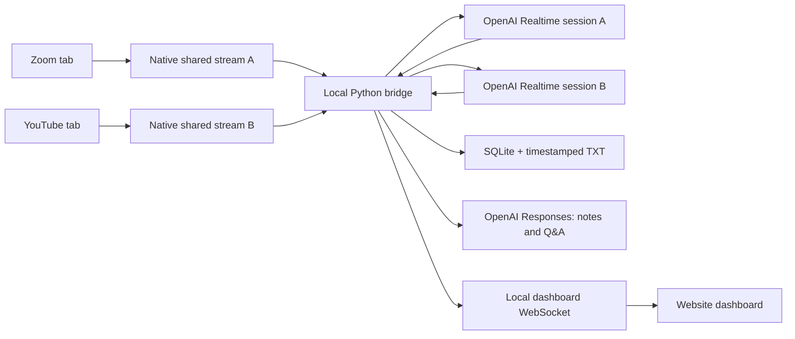

# DaListener

### An OpenAI meeting and media copilot for independent Chromium tabs

[](https://www.microsoft.com/windows)
[](https://www.apple.com/macos/)
[](https://developers.openai.com/)
[](https://www.python.org/)
[](https://github.com/TheRealStubbornDeveloper/DaListener)

DaListener captures audio from tabs selected through Chromium's native sharing dialog. Every shared tab becomes an independent transcription stream with its own transcript, alerts, notes, and Q&A context. No browser extension is required.


> [!IMPORTANT]
> Choose **Local**, **Cloud**, or **Auto** explicitly. Local mode keeps English transcription and meeting intelligence on the machine with Moonshine/faster-whisper, LFM2.5-8B-A1B, and llama.cpp. The dashboard always identifies the active provider.

## Alpha 2 status

| Area | Status |
|---|---|
| Windows 10/11 | MSI and portable ZIP built and validated locally |
| Chromium capture | Native Chrome and Edge tab sharing, including simultaneous independent tabs |
| Meeting sources | Zoom, Google Meet, Microsoft Teams, and Webex start directly |
| Media sources | YouTube, Vimeo, Twitch, and unfamiliar sites require confirmation |
| macOS 13+ | Application and universal DMG build scripts are ready; VM build/testing remains on the roadmap |

Current Windows MSI SHA-256:

```text
8c9c3c62f8e9e336a222959696c58d5490c80f3ba7912b5025532cf53569d88c
```

## What it does

- Captures multiple meeting or media tabs independently; overlapping streams never get mixed together.
- Uploads audio or video files from the dashboard for transcription, watched-name highlighting, summaries, and action items; watched names default to `Vlad, Vladimir` and are editable per upload.
- Recognizes common meeting sites such as Zoom, Google Meet, Teams, and Webex.
- Warns before capturing YouTube, Vimeo, Twitch, or an unfamiliar source.
- Uses `gpt-realtime-whisper` for low-latency streaming transcription.
- Saves final revisions in SQLite for recovery and writes a timestamped TXT file when capture stops.
- Detects `Vladimir` and `Vlad` with exact local matching and highlights the relevant utterance.
- Refreshes grounded summaries, decisions, action items, unfamiliar-technology explanations, and conservative reply suggestions after new finalized speech; OpenAI is preferred and prepared LFM is the fallback.
- Answers questions such as “What did Arjun just say?” using the selected stream's transcript.
- Never requests microphone access. Join as a listener on this machine and speak from another device.
- Keeps the OpenAI API key in the Python bridge and operating-system keychain—not in dashboard JavaScript.

## Architecture



Every captured tab attempts OpenAI first. If a stream loses quota, authentication, rate-limit capacity, model access, or its network connection, DaListener preserves a bounded 15-second audio window and switches only that tab to prepared local transcription after a five-second retry window. Streams are never merged. Local concurrency is disclosed from the hardware scan; cloud concurrency still depends on the OpenAI project tier.

## How near-real-time transcription works

The browser sends 32-bit mono PCM chunks to a dedicated local WebSocket for each selected tab. Audio never passes through React. The Python bridge routes each stream independently and keeps queues bounded so a slow provider cannot consume memory indefinitely.

| Stage | OpenAI path | Local path |
|---|---|---|
| Capture | Chromium `getDisplayMedia()` with tab audio | Same |
| Drafts | Realtime transcription deltas | Moonshine updates every 200 ms in Best mode or 300 ms in Balanced mode |
| Utterance boundary | 450 ms silence or five seconds of continuous speech | VAD, with an eight-second maximum segment in Best/Balanced mode |
| Final text | OpenAI completed event | Moonshine final, optionally refined by faster-whisper when its queue is free |
| Backpressure | Bounded async queue | Bounded worker queue per tab; measured backlog shown on the meeting card |

DaListener prioritizes live transcription over refinement and LFM inference. If Whisper is still refining one utterance, the next Moonshine final is accepted immediately instead of joining a growing finalizer queue. Local LFM is prewarmed while the 30-second notes timer runs.

Responsiveness and accuracy are disclosed separately. Draft latency is affected by CPU load, simultaneous tabs, browser scheduling, silence detection, source quality, and whether OpenAI is reachable. The meeting card reports measured local backlog; a growing value means the selected number of local tabs is too high for the current load.

### Measured development-machine reference

These are July 2026 observations from a Ryzen 7 5700X, 32 GB RAM, and RTX 3090. They are reference measurements, not guarantees for other systems or audio.

| Measurement | Result |
|---|---|
| Local provider selection | Confirmed Local mode; no OpenAI attempt |
| First Moonshine draft from paced speech | 1.59 seconds after speech began |
| Final phrase from a five-second fixture | 1.69 seconds after the fixture ended |
| Warm local LFM notes on a saved meeting | 8.62 seconds, including failed OpenAI-first time before explicit modes were added |
| Persisted local notes validation | Summary plus five action items restored from SQLite |

Use the dashboard's current measured backlog and calibration for the authoritative forecast on the running machine.

## Provider routing and failure behavior

1. Each tab opens an independent OpenAI Realtime transcription session.
2. Recoverable OpenAI failures retain a bounded rolling audio window while DaListener retries for five seconds.
3. If local transcription is prepared, only the affected tab switches to Moonshine; it never switches back during that meeting.
4. A timeline event records the provider change and reason.
5. If local fallback is not prepared, capture reports an actionable error instead of pretending to be live.
6. Notes try OpenAI first. If that fails and LFM is ready, the same transcript is summarized locally.

Current local mode is English-only. OpenAI quota and model access belong to the configured API project; having a syntactically valid API key does not guarantee usable quota.

The dashboard provider selector is persistent:

- **Local** bypasses OpenAI for transcription, summaries, action items, Q&A, and suggested responses.
- **Cloud** uses OpenAI only and never starts local fallback.
- **Auto** attempts OpenAI first and sends failed work to prepared local providers.

## Cost and free fallback

`gpt-realtime-whisper` is currently listed at **$0.017 per audio minute**, or **$1.02 per hour for each active captured tab**. Two one-hour tabs are approximately $2.04 and four are approximately $4.08. DaListener refreshes this value from the [official model page](https://developers.openai.com/api/docs/models/gpt-realtime-whisper), timestamps it, and labels a cached price as stale when the page cannot be reached or parsed.

The dashboard records only audio duration accepted for OpenAI delivery and shows per-meeting, today, and current-month DaListener estimates. A normal project API key cannot provide organization-wide billing totals. Organization owners may add a separate Admin key to retrieve audio-transcription usage and total costs; without it, the dashboard explicitly says its numbers are DaListener estimates.

Local fallback has no OpenAI per-minute transcription charge, but it uses local disk space, RAM, CPU/GPU time, and electricity. The standard MSI prepares missing models and llama.cpp on demand with visible progress, transfer speed, cancellation, and resume support. The full offline Windows package includes the prepared English models plus both CUDA and CPU llama.cpp runtimes, so its `DaListener.exe` can run without Python, Node.js, or a first-run model download.

Local components:

- Moonshine Medium Streaming for live English drafts.
- faster-whisper `large-v3-turbo` on compatible CUDA hardware, or `small` CPU INT8 otherwise, for finalized utterances.
- `LiquidAI/LFM2.5-8B-A1B` GGUF Q4 through a managed, authenticated, loopback-only `llama-server` for grounded notes and questions. Review the [complete LFM license](https://huggingface.co/LiquidAI/LFM2.5-8B-A1B-GGUF/blob/main/LICENSE): commercial use by a legal entity with annual revenue of at least USD 10 million requires a separate Liquid AI license. This is a license summary, not legal advice. On Windows, local preparation downloads the appropriate official [llama.cpp](https://github.com/ggml-org/llama.cpp/releases) runtime and verifies its published SHA-256 digest. Set `DALISTENER_LLAMA_SERVER` only to override the managed runtime.

### Local preparation states

| State | Meaning |
|---|---|
| `not-prepared` | No usable local transcription package exists yet |
| `preparing` | Models or runtime are downloading, extracting, or calibrating |
| `partial` | Local transcription works, but LFM intelligence is unavailable |
| `ready` | Local transcription and authenticated LFM intelligence are available |
| `error` | Preparation failed; the dashboard shows the exact reason and retains resumable downloads |

The full package includes the upstream LFM and llama.cpp license texts in `licenses/`; [THIRD_PARTY_NOTICES.md](THIRD_PARTY_NOTICES.md) records attribution. Multi-gigabyte generated payloads stay under ignored `dist/` and are never committed to Git.

## Install on Windows

The easiest option is the locally built MSI. Opening it requests administrator approval once because it installs for all users under `Program Files`. DaListener itself runs with normal user privileges.

### Quick start with the MSI

1. Build the installer with `build-msi.ps1`, or obtain the alpha 2 MSI from the project owner.
2. Open `dist\DaListener-0.3.0-alpha.2-windows-x64.msi` and approve the installer prompt.
3. Start **DaListener** from the Windows Start menu.
4. Save an OpenAI project API key in the one-time setup panel. Optionally prepare the free local fallback and add a separate organization Admin key for account totals.
5. Select **Add audio source**, choose a Chromium tab, and enable **Share tab audio**.
6. Repeat for every simultaneous meeting or media tab. Each selection receives a separate transcript and provider session.

Use **Stop DaListener** in the dashboard or the Start-menu shortcut when finished. Starting the executable again reopens the single healthy local instance.

### Full offline plug-and-play package

The full package is a self-contained directory because putting a multi-gigabyte GGUF into an MSI cabinet is unreliable and would duplicate the model under `Program Files`. The currently verified payload is approximately **6.72 GB**. Build it on this Windows machine after preparing Local mode once:

```powershell
.\build-full-windows.ps1
```

Output:

```text
dist\DaListener-0.3.0-alpha.2-windows-x64-full\
  DaListener.exe
  START-HERE.txt
  offline-assets\
  licenses\
```

Copy that folder to a Windows 10/11 x64 machine and run `DaListener.exe`. It detects NVIDIA CUDA versus CPU automatically and uses the matching bundled llama.cpp runtime. Run `DaListener.exe --stop` or use the dashboard button to stop every capture and the local server. The standard MSI remains the smaller administrator-assisted installation and automatically downloads missing local assets after license acceptance.

The alpha installer is unsigned, so Windows can show an **Unknown publisher** warning. Verify its SHA-256 against the value above before installation.

```powershell
(Get-FileHash .\dist\DaListener-0.3.0-alpha.2-windows-x64.msi -Algorithm SHA256).Hash.ToLowerInvariant()
```

### Run from source

For a source checkout, install Python 3.11+, Node.js 20+, Chrome/Edge 116+, and configure an OpenAI API key with billing and Realtime API access:

```powershell
git clone https://github.com/TheRealStubbornDeveloper/DaListener.git
cd DaListener
git switch codex/feature-rich-mvp
.\setup.bat
.\run.bat
```

The dashboard opens in the default browser. Paste the OpenAI API key into the one-time setup card; DaListener stores it in Windows Credential Manager.

Source mode serves the same production dashboard as the packaged app. After pulling frontend changes, run `npm.cmd --prefix frontend run build` or rerun `setup.bat` before starting DaListener.

### If the dashboard does not open

`run.bat` waits for the local server to report that it is ready before the browser is opened. It also writes live startup logs to:

```text
%LOCALAPPDATA%\DaListener\Logs\dashboard.stdout.log
%LOCALAPPDATA%\DaListener\Logs\dashboard.stderr.log
```

The dashboard normally uses `127.0.0.1:8765` with a persistent local launch token. Running `run.bat` again opens the existing healthy instance instead of starting another listener. If another application owns port 8765, DaListener uses a temporary local address for that run. If startup fails, the command window prints the error and log location instead of exiting silently.

### Capture tabs without an extension

1. Open a Zoom, Meet, Teams, Webex, YouTube, or other audio tab.
2. In DaListener, select **Add audio source**.
3. In Chromium's native dialog, choose **Chrome Tab** or **Edge Tab** rather than an entire screen or window.
4. Enable **Share tab audio**, then select **Share**.
5. Repeat from **Add audio source** for every simultaneous meeting.
6. Stop a stream from its DaListener meeting card or Chromium's sharing indicator.

Chromium requires a fresh user confirmation for every selected source and intentionally prevents silent tab capture. DaListener requests a tiny low-frame-rate video track only because browsers require video when requesting display audio; it processes and transmits only the audio track. Non-meeting sources receive an explicit confirmation before their audio is sent onward.

Chromium sometimes exposes the selected tab title and sometimes returns only an opaque `web-contents-media-stream://…` identifier. DaListener uses an exposed title when available and otherwise asks for a display name after selection. If two captures have the same display name, the later one receives a short random suffix such as `Daily stand-up · a4f2`.

An API key can be stored correctly while its API project has no usable quota. If capture reports `OpenAI API quota is unavailable`, add API billing or credits to that project and retry.

## Meeting intelligence

- The first finalized utterance schedules a notes refresh for 30 seconds later.
- LFM begins warming during that countdown so model startup does not get added after the timer.
- Additional utterances within the same window are included in the pending summary.
- **Generate now** requests an immediate refresh.
- Summaries, key points, decisions, action items, technology explanations, and conservative response suggestions are stored in SQLite and restored after reload.
- Suggested responses are emitted only when `Vladimir` or `Vlad` is directly addressed and transcript evidence is sufficient.
- Questions are grounded in the selected meeting only; concurrent tabs never share retrieval context.

## Uploaded audio and video

The **Upload audio or video** panel accepts a local media file, a comma-separated watched-name list, and an explicit Local/Cloud/Auto provider choice. PyAV decodes the audio track inside the packaged app, so users do not install FFmpeg separately. Local jobs use the prepared English Moonshine model and LFM; cloud jobs use OpenAI `gpt-4o-transcribe` and the configured intelligence model. Results include the timestamped transcript, exact whole-name mentions, grounded notes, action items, and a TXT file under the upload transcript folder. The default watched names are `Vlad` and `Vladimir`, but they are parameters rather than hard-coded behavior.

## Troubleshooting

| Symptom | Check |
|---|---|
| `Could not connect the shared tab` | Close old dashboard tabs, run `run.bat` again, and use the newly opened authenticated tab |
| Picker returns no audio | Select **Chrome Tab** or **Edge Tab** and enable **Share tab audio**; window/screen sharing may omit tab audio |
| OpenAI quota unavailable | Add billing/credits to the API project or finish preparing local fallback |
| Local transcription feels delayed | Read the measured backlog on the meeting card; stop extra local tabs or reduce other CPU-heavy work |
| Summary remains empty | Confirm finalized transcript exists and the local card says `ready`, then select **Generate now** |
| Local card says `partial` | Select **Finish local intelligence setup** to download the managed llama.cpp runtime |
| LFM startup fails | Inspect `%LOCALAPPDATA%\DaListener\DaListener\Models\LocalFallback\llama-server.log` |
| Dashboard refuses an old launch URL | Run `run.bat`; it uses the persistent current launch token and reopens the healthy instance |
| Startup fails | Inspect `%LOCALAPPDATA%\DaListener\Logs\dashboard.stderr.log` and `dashboard.stdout.log` |

## Development

Backend and production dashboard:

```powershell
.venv\Scripts\Activate.ps1
npm.cmd --prefix frontend run build
python -m dalistener.dashboard.server
```

Frontend hot reload (run the backend separately):

```powershell
npm.cmd --prefix frontend run dev
```

Tests:

```powershell
python -m pytest
npm.cmd --prefix frontend run build
```

Set `OPENAI_API_KEY` to use an environment variable instead of the OS keychain. The service reads `DALISTENER_TRANSCRIPTION_MODEL`, `DALISTENER_REALTIME_MODEL`, and `DALISTENER_INTELLIGENCE_MODEL` for model overrides.

### Main API endpoints

All application endpoints require the authenticated local dashboard session.

| Endpoint | Purpose |
|---|---|
| `GET /api/v1/bootstrap` | Meetings, provider state, pricing, usage, capability, and browser-audio session token |
| `WS /api/v1/browser/audio` | One authenticated PCM stream per selected Chromium tab |
| `WS /api/v1/events` | Transcript, meeting, preparation, notes, and status events |
| `GET /api/v1/pricing` | Cached or refreshed OpenAI transcription price |
| `GET /api/v1/usage` | Per-meeting, daily, and monthly DaListener estimates |
| `GET /api/v1/capability` | Local hardware, runtime, calibration, and recommended concurrency |
| `POST /api/v1/local-model/prepare` | Resume local model/runtime preparation after license acceptance |
| `GET /api/v1/meetings/{id}/transcript` | Stored revisions for one meeting |
| `GET /api/v1/meetings/{id}/notes` | Last persisted meeting-intelligence result |
| `POST /api/v1/meetings/{id}/summarize` | Generate grounded notes immediately |
| `POST /api/v1/meetings/{id}/ask` | Ask a transcript-grounded question |

### Repository layout

```text
dalistener/             Python capture, transcription, storage, capability, and dashboard API
dalistener/dashboard/   Browser routing, providers, billing, notes, and local runtime management
frontend/               React/Vite dashboard and native Chromium capture client
packaging/              PyInstaller and platform packaging definitions
scripts/                Source launch helpers
tests/                  Backend, billing, fallback, authentication, and persistence tests
docs/screenshots/       README dashboard images
dist/                   Local build output; not the source of truth
```

## Build Windows packages locally

No GitHub-hosted runner is required. The portable archive build is:

```powershell
powershell.exe -NoProfile -ExecutionPolicy Bypass -File .\build-release.ps1
```

The MSI build also creates the portable archive, downloads the official .NET 8 SDK into `build\tools`, installs WiX 5 locally, and writes an SHA-256 checksum:

```powershell
powershell.exe -NoProfile -ExecutionPolicy Bypass -File .\build-msi.ps1
```

Outputs:

```text
dist\
|-- DaListener\
|   |-- DaListener.exe
|   `-- _internal\
|-- DaListener-0.3.0-alpha.2-windows-x64.zip
|-- DaListener-0.3.0-alpha.2-windows-x64.msi
`-- DaListener-0.3.0-alpha.2-windows-x64.msi.sha256
```

Beta packages are unsigned by default. To sign locally, install `signtool.exe` and set `DALISTENER_WINDOWS_SIGN_PFX` and `DALISTENER_WINDOWS_SIGN_PASSWORD` before running the MSI build.

The build is intentionally local: it does not create or require a GitHub Actions workflow. Upload the MSI, ZIP, and checksum to a GitHub Release manually when a public prerelease is desired.

## Build macOS in the future VM

The application code, Finder integration, OS keychain storage, universal PyInstaller specification, DMG creation, architecture checks, signing, and optional notarization hooks are included. The DMG must be built and tested on macOS; PyInstaller cannot cross-compile it from Windows.

On a locally controlled macOS 13+ VM with Python 3.11+, Node.js 20+, and Xcode command-line tools:

```bash
chmod +x ./build-release-macos.sh
./build-release-macos.sh
```

The script builds `dist/DaListener.app` and `dist/DaListener-0.3.0-alpha.2-macos-universal.dmg`, verifies both Apple Silicon and Intel slices, and writes a checksum. It uses ad-hoc signing unless `APPLE_CODESIGN_IDENTITY` is set. Set the `APPLE_NOTARY_*` variables to notarize with an App Store Connect key.

## File locations

| Item | Windows | macOS / source |
|---|---|---|
| Portable executable | `dist\DaListener\DaListener.exe` | — |
| MSI / DMG | `dist\DaListener-0.3.0-alpha.2-windows-x64.msi` | `dist/DaListener-0.3.0-alpha.2-macos-universal.dmg` |
| Timestamped transcripts | `%LOCALAPPDATA%\DaListener\DaListener\Transcripts` | `~/Library/Application Support/DaListener/Transcripts` |
| Recovery database | `%LOCALAPPDATA%\DaListener\DaListener\sessions.db` | `~/Library/Application Support/DaListener/sessions.db` |
| Local fallback models and calibration | `%LOCALAPPDATA%\DaListener\DaListener\Models\LocalFallback` | `~/Library/Application Support/DaListener/Models/LocalFallback` |
| Dashboard launch authentication | `%LOCALAPPDATA%\DaListener\DaListener\dashboard-auth.json` | `~/Library/Application Support/DaListener/dashboard-auth.json` |
| Startup logs | `%LOCALAPPDATA%\DaListener\Logs` | Terminal output |
| OpenAI API key | Windows Credential Manager | macOS Keychain or `OPENAI_API_KEY` |
| OpenAI Admin key (optional) | Windows Credential Manager | macOS Keychain or `OPENAI_ADMIN_KEY` |

## Privacy and consent

Raw audio is kept only in bounded memory while relayed to the active provider and is not written to disk. OpenAI-mode audio and transcript context are sent to OpenAI; local-mode processing stays on the computer. Final transcript text and generated notes are sensitive data. Notify participants, follow applicable recording and consent laws, protect the local account, and configure appropriate OpenAI data controls.

The bridge and managed LFM server listen only on `127.0.0.1`. Dashboard APIs require an HttpOnly session cookie. Browser-audio WebSockets use a random in-memory token returned only by the authenticated bootstrap response. The LFM endpoint has its own random bearer token, and secrets are never written into dashboard JavaScript bundles.

## Roadmap

- Build and test the universal macOS application and DMG inside the locally controlled macOS VM.
- Keep release builds on developer machines and that VM. Completed MSI, DMG, and checksum files can be uploaded to GitHub Releases manually; DaListener will not depend on paid GitHub-hosted runners.
- Add production Windows signing and Apple Developer ID notarization credentials when distribution is ready.

## Current boundaries

- Chromium tab audio only; no microphone, native Zoom desktop-process capture, or per-speaker diarization.
- A user must approve every tab through Chromium's native sharing dialog; browsers do not permit silent capture.
- Speaker names are preserved only when spoken or supplied in transcript text; tab audio does not expose Zoom participant metadata.
- Email notifications need a separately configured mail provider and are not enabled in this alpha.
- The Windows MSI is locally validated but unsigned; the macOS package remains unverified until it is built in the VM.

## License

No open-source license has been selected. The source is all-rights-reserved.
